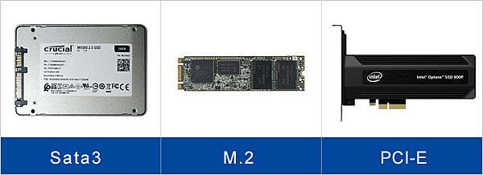

# Storage Device(儲存裝置) 隨筆

如果要開始組裝自己既 NAS/ Private Server，請了解 Storage Device:

1. 儲存設備 (HDD、SSD 、 SSHD....etc)
2. 介面標準(M.2 、PCIe 和 SATA....)

## 儲存裝置（Storage Device）

### **硬盤機（HDD）**

- 一種傳統的磁性儲存裝置，使用旋轉磁碟來儲存和檢索資料。
  - 因此，它是**最慢**的。
- 硬碟不同既尺寸，包括 **2.5 吋**和**3.5 吋**。
- 提供大型的儲存容量（最高可達 22 TB，當然是**很貴**）
- 價錢**比 SSD 便宜**，但硬碟**比 SSD 慢**，且更容易受到物理損傷
- 接口有:
  1.  SATA(Serial ATA)
  2.  SAS (Serial Attached SCSI)

### 固態硬盤（SSD）

- 使用閃存儲存和檢索資料的**新型儲存裝置**。
- SSD 提供比 HDD**更快的讀寫速度**，以及更好既耐用性和可靠性。
- 固態硬盤有不同既形式，包括 2.5 吋。
- 接口有:
  1.  SATA III(Serial ATA)
  2.  M.2
  3.  U.2
  4.  NVMe
  5.  PCIe

### 混合儲存（SSHD）

- 硬盤機和固態硬盤技術的組合。
- 混合儲存使用小量的固態硬盤儲存用於常用的文件，並使用較大的硬盤機儲存不常用的文件。
- 這使得常用應用程式的效能更快，而且比起固態硬盤，仍然提供更大的儲存容量和更低既價錢。

---

_注意：這些是一般性的說明和比較，實際的效能和價格可能因廠商和型號而異。_

### 小總結

總之，當選擇儲存裝置時，需要考慮速度、儲存容量、可靠性和價格等因素。 傳統磁性硬盤（HDD）提供大型儲存容量，但速度較慢且容易受到物理損傷。 固態硬盤（SSD）提供更快的讀寫速度和更好的耐用性和可靠性，但價格通常比 HDD 更高。 混合儲存（SSHD）是一種優化的解決方案，可以提供更快的應用程式效能和更大的儲存容量，價格比固態硬盤便宜。 選擇適合您需求的儲存裝置將有助於提高您的系統效能和效率。

---

## 儲存裝置接口（Interface Standards）

### SATA (Serial ATA)

- SATA 是一種用於將儲存裝置連接到電腦主機板的介面標準。
- SATA III 是 SATA 介面的最新版本，其最大資料傳輸速率為 6 Gbps。
- SATA III 通常用於將 HDD 和 SSD 連接到電腦主機板。

### PCIe

- PCIe（週邊連接表達）是一種高速介面標準，用於將各種週邊連接到電腦主機板，包括圖形卡、網路卡和儲存設備。
- PCIe SSD 使用 PCIe 介面提供比 SATA 和 M.2 SSD 更快的資料傳輸速度。

### NVMe

- NVMe（非揮發性記憶體表達）是專門為 PCIe SSD 設計的較新協定。
- NVMe SSD 提供比傳統的 SATA 和 M.2 SSD（使用 AHCI 協定）更快的讀寫速度。

### M.2

- M.2 是較新的介面標準，支援 SATA 和 PCIe 協定。
- 使用 PCIe 介面的 M.2 SSD 可以提供比 SATA III SSD 更快的資料傳輸速度。
- M.2 SSD 通常比傳統的 2.5 吋 SSD 更小且更緊湊。

### U.2

- U.2 是一種較少使用的介面標準，與 M.2 類似，但使用較大的形式因子。
- U.2 SSD 通常用於企業環境，並提供高效能和可靠性。

### 小總結

儲存設備連接到電腦主機板使用不同的介面標準，包括 SATA、M.2、U.2、NVMe 和 PCIe。 選擇介面標準取決於特定的使用案例和效能要求。 SATA 通常用於連接 HDD 和 SSD，而 M.2 和 PCIe 通常用於高效能 SSD。 NVMe 是專為 PCIe SSD 設計的較新協議，提供比傳統的 SATA 和 M.2 SSD 更快的讀寫速度。 U.2 是一種較少使用的介面標準，類似於 M.2，但使用較大的形式因子，通常用於企業環境。

- 與 SATA SSD 相比，NVMe SSD 通常提供更高的讀寫速度，但並非所有 NVMe SSD 都比所有 SATA SSD 更快。 SSD 的實際效能取決於多種因素，包括所使用的 NAND 快閃記憶體類型、控制器和介面。
- 與 NVMe SSD 相比，PCIe SSD 可以提供更高的讀寫速度，但並非所有 PCIe SSD 都比所有 NVMe SSD 更快。 同樣，實際性能取決於多種因素。
- M.2 不是一種協定或接口，它是一種可以同時支援 SATA 和 NVMe 接口的外形規格。 因此，M.2 SSD 的效能取決於特定介面和上述其他因素。

綜上所述，儲存設備的效能取決於多種因素，包括儲存設備的類型、介面、控制器以及所使用的 NAND 快閃記憶體。 雖然 NVMe SSD 通常比 SATA SSD 提供更高的效能，且 PCIe SSD 與 NVMe SSD 相比可以提供更高的效能，但實際效能可能會因特定裝置和配置而異。

---

## 總結 (Summary)

以下是儲存裝置和介面標準的總結：

1. 儲存裝置（Storage Devices）

   - **硬碟機（HDD）**：傳統磁性存儲裝置，速度較慢，容易受到物理損傷，但提供大型存儲容量，價格比 SSD 便宜。
   - **固態硬碟（SSD）**：使用閃存存儲資料的新型存儲裝置，速度較快，耐用性和可靠性更好，但價格通常比 HDD 更高。
   - **混合儲存（SSHD）**：硬碟機和固態硬碟技術的組合，提供更快的應用程式效能和更大的存儲容量，價格比固態硬碟便宜。

2. 介面標準（Interface Standards）
   - **SATA（Serial ATA）**：一種用於連接存儲裝置到電腦主機板的介面標準，最新版本為 SATA III，最大資料傳輸速率為 6 Gbps。
   - **PCIe（週邊連接表達）**：一種高速介面標準，用於將各種週邊裝置連接到電腦主機板，包括圖形卡、網路卡和儲存裝置。
   - **NVMe（非揮發性記憶體表達）**：專門為 PCIe SSD 設計的較新協定，提供比傳統的 SATA 和 M.2 SSD（使用 AHCI 協定）更快的讀寫速度。
   - **M.2**：一種較新的介面標準，支援 SATA 和 PCIe 協定，使用 PCIe 介面的 M.2 SSD 可以提供比 SATA III SSD 更快的資料傳輸速度。
   - **U.2**：一種較少使用的介面標準，與 M.2 類似，但使用較大的形式因子，通常用於企業環境。

總之，選擇適合您需求的儲存裝置和介面標準將有助於提高系統效能和效率。 傳統磁性硬碟（HDD）提供大型儲存容量，但速度較慢且容易受到物理損傷。 固態硬碟（SSD）提供更快的讀寫速度和更好的耐用性和可靠性，但價格通常比 HDD 更高。 混合儲存（SSHD）是一種優化的解決方案，可以提供更快的應用程式效能和更大的儲存容量，價格比固態硬碟便宜。 選擇適合您需求的儲存裝置將有助於提高您的系統效能和效率。

---

## 儲存裝置選擇

- 在選擇儲存裝置時，需要考慮速度、儲存容量、可靠性和價格等因素。
- HDD 提供大型儲存容量，但速度較慢且容易受到物理損傷。
- SSD 提供更快的讀寫速度和更好的耐用性和可靠性，但通常比 HDD 貴。
- 混合儲存（SSHD）是一種優化的解決方案，可以提供更快的應用程式效能和更大的儲存容量，價格比固態硬碟便宜。
- 選擇適合您需求的儲存裝置將有助於提高您的系統效能和效率。
