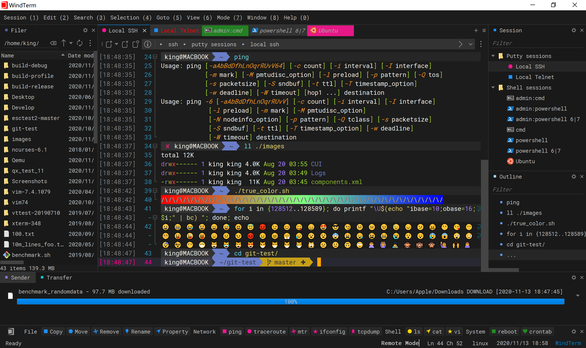

# Make your terminal more Beautiful

5 知大家用 mac 定 windows?
有冇覺得 terminal 好醜呢?
下面係一 D upgrad terminal 既工具??(唔知點樣歸類 \*\*

## 1. Oh my ZSH + Powerlevel10k

- 安裝方法(for windows): https://vocus.cc/article/6440dcb1fd89780001d1b37d
- 安裝方法(for mac): https://www.onejar99.com/terminal-iterm2-zsh-powerlevel10k/
- price: **free**
- github: https://github.com/ohmyzsh/ohmyzsh
- web: https://ohmyz.sh/

- github: https://github.com/romkatv/powerlevel10k

- 自定義字體: https://www.nerdfonts.com/font-downloads

perview:

## 2. WindTerm

- 安裝方法: https://github.com/kingToolbox/WindTerm/releases/tag/2.6.0
  

- price: **free**
- github: https://github.com/kingToolbox/WindTerm
- web: https://kingtoolbox.github.io/

perview:

## 3. Xterminal

- 安裝方法: https://www.terminal.icu/
- price: **free** && 會員制(要畀錢解鎖部分功能)

perview:

