# Software Installation (Ubuntu OS)

### Part 0: Prerequisites

### 0.1 Show Hidden Folder

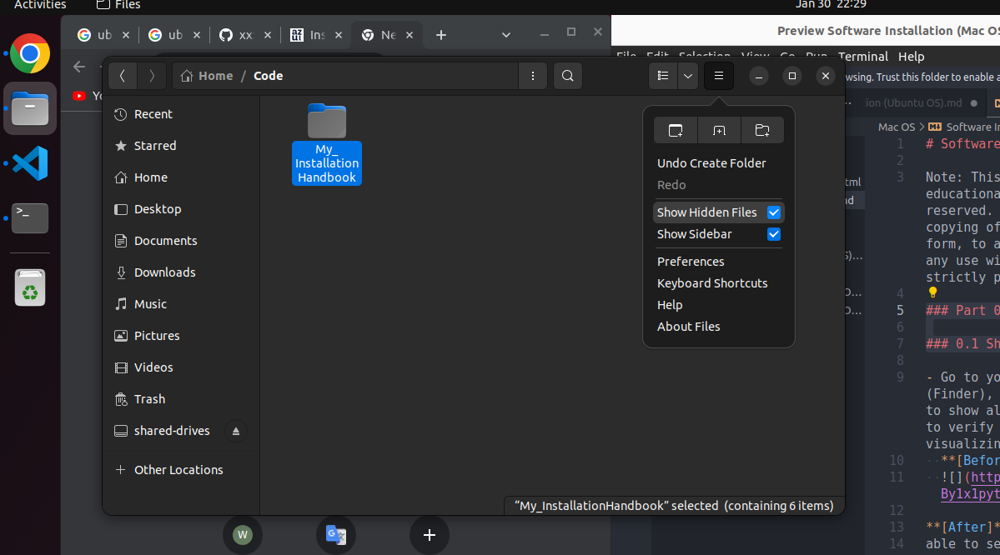

## Part 1 : ZSH +Oh my Zsh + Power10k

### 1.1 Install the Nerd font

1.1 Download the font from here
[Nerd Font](https://www.nerdfonts.com/font-downloads)

and install it
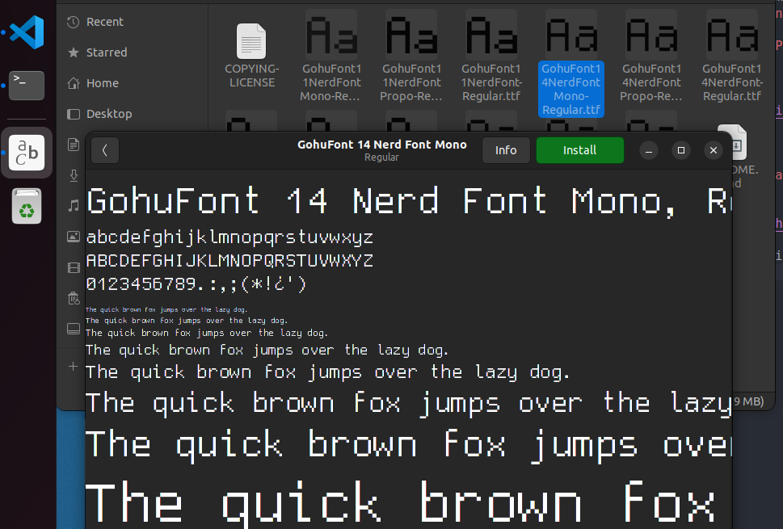

### 1.2 Set the Terminal font and colour you like

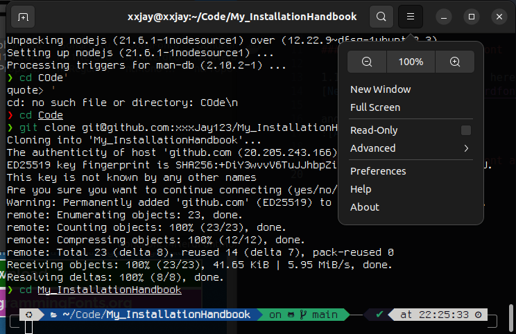
-> add the Profiles and set default
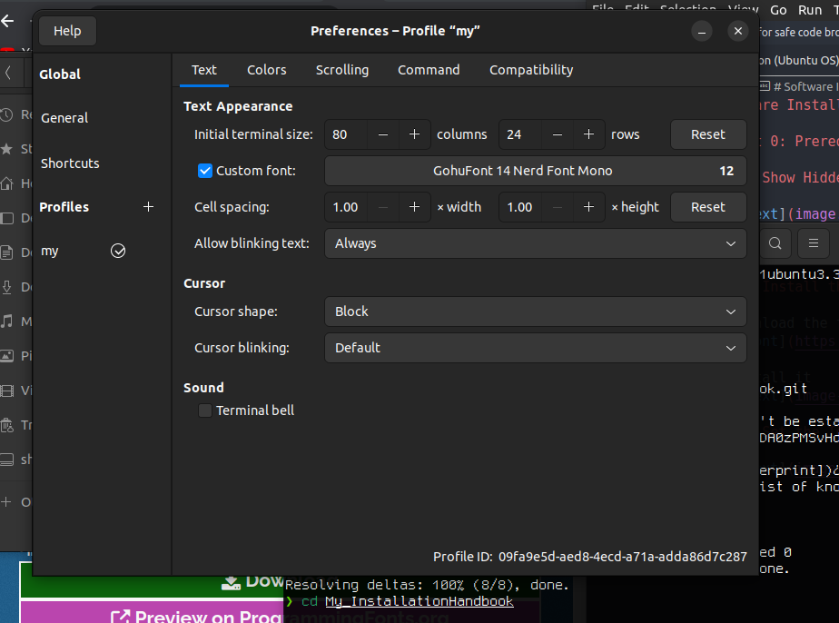

### 1.3 Install Zsh

```shell
sudo apt install zsh -y
```

### 1.4 Install Oh My Zsh

```shell
sh -c "$(curl -fsSL https://raw.githubusercontent.com/ohmyzsh/ohmyzsh/master/tools/install.sh)"
```

### 1.5 Set Default Shell

```shell
chsh -s $(which zsh) ##set shell
zsh ##run zsh
```

### 1.6 Install PowerLevel10K & Plugins

```shell
git clone https://github.com/romkatv/powerlevel10k.git $ZSH_CUSTOM/themes/powerlevel10k
```

#### Plugins : zsh-autosuggestions

```shell
git clone https://github.com/zsh-users/zsh-autosuggestions ${ZSH_CUSTOM:-~/.oh-my-zsh/custom}/plugins/zsh-autosuggestions
```

#### Plugins : zsh-syntax-highlighting

```shell
git clone https://github.com/zsh-users/zsh-syntax-highlighting.git ${ZSH_CUSTOM:-~/.oh-my-zsh/custom}/plugins/zsh-syntax-highlighting
```

#### Plugins : Zsh-z

```bash
git clone https://github.com/agkozak/zsh-z $ZSH_CUSTOM/plugins/zsh-z
```

### 1.7 Enable PowerLevel10k and All Plugins

```shell
vi ~/.zshrc
```

```shell
ZSH_THEME="powerlevel10k/powerlevel10k" ##Enable PowerLevel10k Theme

plugins=(git zsh-autosuggestions zsh-syntax-highlighting zsh-z) ##Enable Plugins
```

PS: if not works:
restart shell and

```zsh
p10k configure
```

than U get nice Terminal here:


## Part 2: Install Git and SSH to Github

### 2.1 Install Git

```shell
apt-get install git ##or
sudo apt-get install git
```

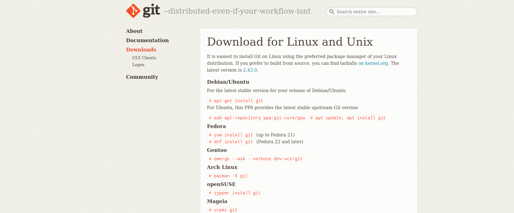

:::success
Result Check
:::

- "where git" to check what git versions are installed. There are 2 git versions installed below, /usr/bin/git is the apple-git where "/opt/homebrew/..." is the one you installed by brew.
- "which git" to check which git version you are currently using.

```
git --version
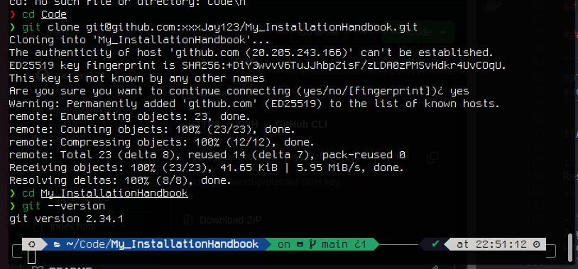
```

### 2.2 Setup SSH key

1. Open Terminal
2. Generate SSH key (by ed25519). Type this command to generate ssh key in your laptop ~/.ssh

```
ssh-keygen -t ed25519 -C "your_email@example.com"
```

3. ==**[Just Enter]**== Prompted to "Enter a file in which to save the key," **press Enter**. Accept default location.

```
> Enter a file in which to save the key
(/Users/you/.ssh/id_algorithm): [Press enter]
```

4. ==**[Just Enter]**== At the prompt, ask for a secure passphrase. Suggest to **press "enter" to skip.**

```
> Enter passphrase (empty for no passphrase): [Type a passphrase]
> Enter same passphrase again: [Type passphrase again]
```

:::success
Result Check
:::
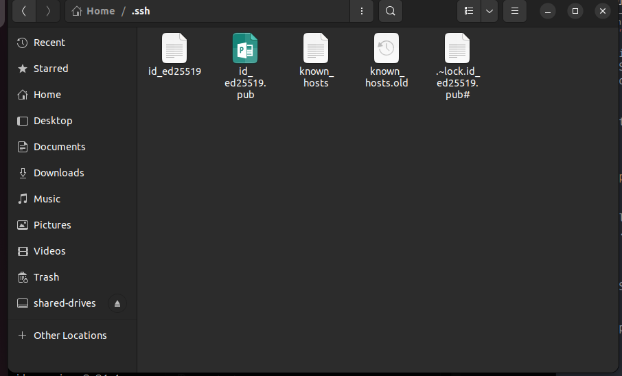

### 2.3 Insert ssh key to Github a/c

1. Login your github account
2. Click the icon at the right top corner, Go to **Settings**.

3. Go to **SSH and GPG keys**, and press N\*\*ew SSH key

4. Place the whole content of **==id_ed25519.pub==(public key)** to "Key" section shown below.
5. For title, simply put your email address.

:::success
Result Check
:::
After adding the ssh key, you can download the github repository by ==git clone== using ==SSH== (You will use it in later installation part).

### 2.4 Git Config

- Change your name & email address. Execute the following commands in Terminal.

```
# set your name when using git
git config --global user.name "your name"
# set your email address when using git
git config --global user.email "your_email@gmail.com"
# default branch name when using git (set to main)
git config --global init.defaultBranch main
# Set pager off for git branch
git config --global pager.branch false
# set pager off for git diff
git config --global pager.diff false
```

## Part 3: Install JDK (Java)

Install from Azul APT repository

You can add Azul’s APT repository to the list of package sources on your system and install Azul Zulu by using your OS package manager.

Installing with a package manager requires root privileges. Log in as `root` or use `sudo` when running the commands below.

### 3.1 Import Azul’s public key:

```shell
sudo apt install gnupg ca-certificates curl
```

```shell
curl -s https://repos.azul.com/azul-repo.key | sudo gpg --dearmor -o /usr/share/keyrings/azul.gpg

```

```shell
echo "deb [signed-by=/usr/share/keyrings/azul.gpg] https://repos.azul.com/zulu/deb stable main" | sudo tee /etc/apt/sources.list.d/zulu.list
```

### 3.2 Update the information about available packages:

```shell
sudo apt update
```

### 3.3 Install the required Azul Zulu package:

```shell
sudo apt install zulu<jdk-version>-jdk
```

`for example`:

```shell
sudo apt install zulu17-jdk
```

### 3.4 o verify your installation, run the `java -version` command. You should see output similar to the following:

```shell
java -version
```

```
#output
openjdk version "17.0.6" 2023-01-17 LTS
OpenJDK Runtime Environment Zulu17.40+19-CA (build 17.0.6+10-LTS)
OpenJDK 64-Bit Server VM Zulu17.40+19-CA (build 17.0.6+10-LTS, mixed mode, sharing)
```

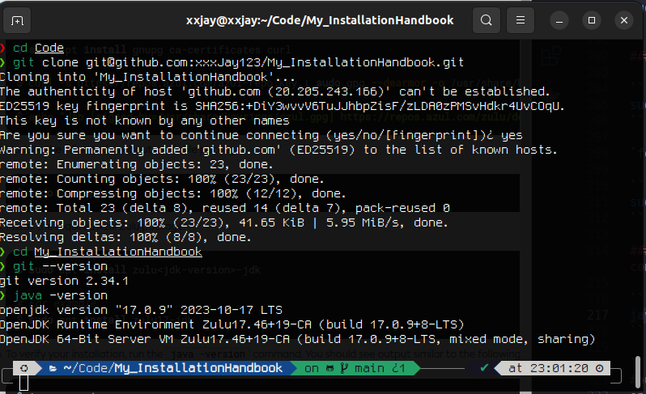

## Part 4: Install Maven

### 4.1. Update the system repository using:

```shell
sudo apt update
```

### 4.2. Install Maven from the official repository:

```shell
sudo apt install maven
```

### 4.3. When prompted, type `Y` and press `Enter` to confirm the installation.

### 4.4. Check the current version of Maven to verify the installation:

```shell
mvn -version
```

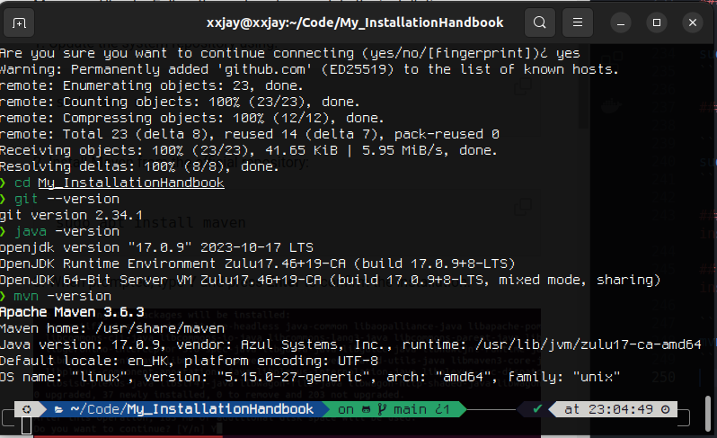

## Part 5: Install VSCode:

### Method 1: Install form Ubuntu Software


find vscode
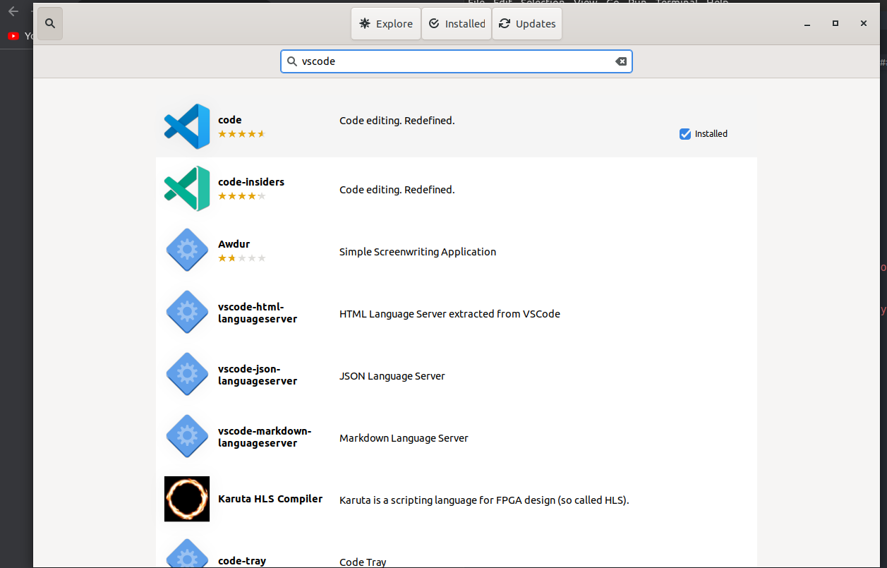

and Install it

### Method 2: Install form Terminal

```shell
sudo snap install --classic code
```

```shell
code --version
```

### 5.5 Install VSCoding Plungins

[My VSCode Setting](https://github.com/xxxJay123/vscode_setting)
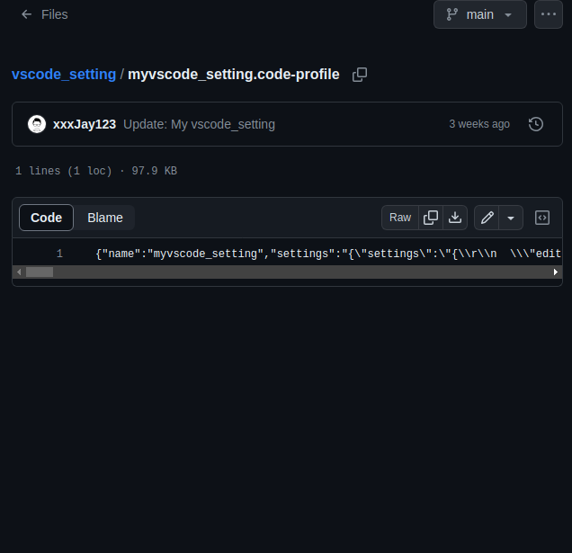

`VSCode > Setting > Profiles > Import Profile > Select Files > myvscode_setting.code-profile`

## Part 6: Install Node.js

### Node.js v21.x:

#### Using Ubuntu

```shell
curl -fsSL https://deb.nodesource.com/setup_21.x | sudo -E bash - &&\
sudo apt-get install -y nodejs
```

```shell
node -v
```

#### Using Debian, as root

```shell
curl -fsSL https://deb.nodesource.com/setup_21.x | bash - &&\
apt-get install -y nodejs
```

```shell
node -v
```

### Node.js v18.x:

#### Using Ubuntu

```shell
curl -fsSL https://deb.nodesource.com/setup_18.x | sudo -E bash - &&\
sudo apt-get install -y nodejs
```

```shell
node -v
```

#### Using Debian, as root

```shell
curl -fsSL https://deb.nodesource.com/setup_18.x | bash - &&\
apt-get install -y nodejs
```

```shell
node -v
```

## Part 7: Install Python

```shell
sudo apt install python3
```

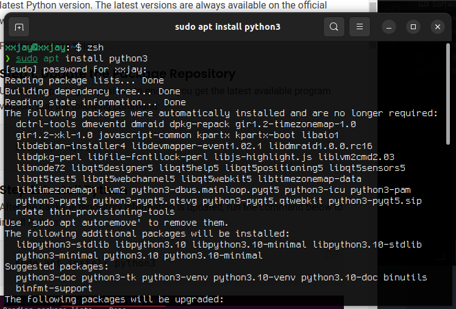

```shell
python3 --version
```

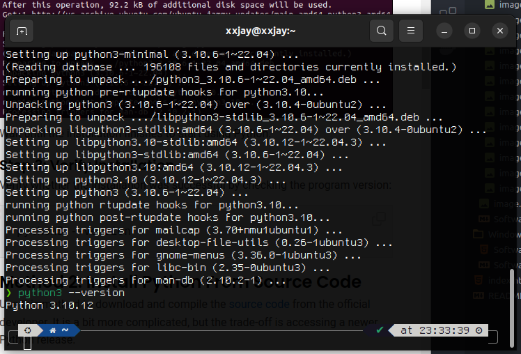


## Part 8: Database

## Redis:
You can install recent stable versions of Redis from the official packages.redis.io APT repository.

- Prerequisites
- If you're running a very minimal distribution (such as a Docker container) you may need to install lsb-release, curl and gpg first:

```shell
sudo apt install lsb-release curl gpg
```

Add the repository to the apt index, update it, and then install:

```shell
curl -fsSL https://packages.redis.io/gpg | sudo gpg --dearmor -o /usr/share/keyrings/redis-archive-keyring.gpg

echo "deb [signed-by=/usr/share/keyrings/redis-archive-keyring.gpg] https://packages.redis.io/deb $(lsb_release -cs) main" | sudo tee /etc/apt/sources.list.d/redis.list

sudo apt-get update
sudo apt-get install redis
```
